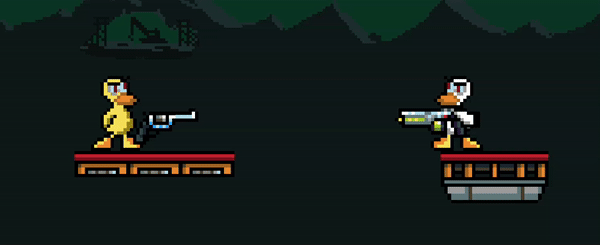

# Duck Game

<p align="center">
  
</p>

Trabajo práctico realizado para la materia Taller de Programación (TA045). FIUBA.

**Integrantes**

- [Federico Letier](https://github.com/FedericoLetier)
- [Juan Pablo Bel](https://github.com/Juannbel)
- [Facundo Lescano](https://github.com/facundolescano0)
- [Lautaro Pedrozo](https://github.com/Lautarop03)

**Corrector**
- [Leonardo Giampieri](https://github.com/leogm99)

<p align="center">
  
</p>


## Dependencias
Las dependencias necesarias para instalar y correr el juego son las siguientes:
- Make
- CMake
- SDL2 (image, mixer y ttf)
- Qt5
- YAML-cpp

Para instalar las mismas en un sistema basado en Debian (como Ubuntu), se puede ejecutar el siguiente comando:

```bash
# Primero instalar Make, necesario para luego instalar las dependencias y compilar
sudo apt-get install make -y
make dependencies
```

## Instalación
### Instalación con dependencias (para sistemas basados en Debian)
Para instalar el juego estando en una distribución de linux basada en Debian, como Ubuntu, ejecutar el siguiente comando:

```bash
sudo apt-get install make -y
make install
```
El target se encargará de instalar las dependencias necesarias para el juego, compilarlo, correr las pruebas y finalmente instalar el juego en el sistema.

### Sin dependencias
Para otros sistemas operativos se puede instalar las dependencias manualmente utilizando el gestor de paquetes correspondiente.

Una vez instaladas las dependencias, puede realizarse la instalación del juego ejecutando el siguiente comando:

```bash
make install-no-deps
```

El target se encargará de compilar el juego, correr las pruebas y finalmente instalar el juego en el sistema.

## Desinstalación
Para desinstalar el juego, ejecutar el siguiente comando:

```bash
make uninstall
```

## Sin instalación
Para correr el juego sin instalarlo, teniendo las dependencias instaladas, ejecutar el siguiente comando para compilar en modo release:

```bash
make compile-release
```
Con esto se generarán los binarios necesarios para correr el juego en la carpeta `build`
Luego pueden ejecutarse los tests con el siguiente comando:

```bash
make run-tests
```

## Ejecución

Para información detallada sobre la ejecución y controles del juego, referise al [manual de usuario](./docs/manual-usuario.md)

### Juego
Para correr el servidor del juego, ejecutar el siguiente comando:

```bash
duck_game_server <puerto>
```
Con esto se iniciará el servidor del juego en el puerto especificado.

Para correr un cliente del juego, ejecutar el siguiente comando:

```bash
duck_game_client
```

En caso de no haber realizado la instalación se debe usar `./build/duck_game_server` y `./build/duck_game_client` en lugar de `duck_game_server` y `duck_game_client`.
Pues los binarios no se instalan en el PATH del sistema.

### Editor de niveles
Para correr el editor de niveles, ejecutar el siguiente comando:

```bash
duck_game_editor
```
En el mismo pueden crearse y editar niveles del juego, que luego serán utilizados en las partidas.
Vale aclarar que los niveles que se utilizan son los que se encuentran en la maquina donde se ejecuta el servidor.

Al igual que con el juego, en caso de no haber realizado la instalación se debe correr `./build/duck_game_editor` en lugar de `duck_game_editor`

## Documentación

Se presentan los siguientes documentos
- [Manual de usuario](/docs/manual-usuario.md)
- [Manual de proyecto](/docs/manual-proyecto.md)
- [Documentación técnica](/docs/documentacion-tecnica.md)