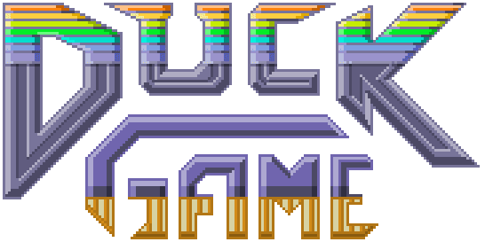

# Duck Game

[](https://www.gnu.org/licenses/gpl-3.0.html)
[](https://cplusplus.com/)


<p align="center">
  
</p>

Juego de disparos multijugador 2D desarrollado como trabajo práctico para Taller de Programación (TA045) en FIUBA.

**Integrantes**

- [Federico Letier](https://github.com/FedericoLetier)
- [Juan Pablo Bel](https://github.com/Juannbel)
- [Facundo Lescano](https://github.com/facundolescano0)
- [Lautaro Pedrozo](https://github.com/Lautarop03)

**Corrector**
- [Leonardo Giampieri](https://github.com/leogm99)

<p align="center">
  
</p>

## 🍿 Demo

https://github.com/user-attachments/assets/0e95e24d-0317-434f-a039-949b980d9127

## ⚡️ Dependencias
Las dependencias necesarias para instalar y correr el juego son las siguientes:
- Make
- CMake
- SDL2 (image, mixer y ttf)
- Qt5
- YAML-cpp

Para instalar las mismas en un sistema basado en Debian (como Ubuntu), se puede ejecutar el siguiente comando:

```bash
# Primero instalar Make, necesario para luego instalar las dependencias y compilar
sudo apt-get install make -y
make dependencies
```

## 📦 Instalación
### Instalación junto con dependencias (Debian/Ubuntu)
Para instalar el juego estando en una distribución de linux basada en Debian, como Ubuntu, ejecutar el siguiente comando:

```bash
sudo apt-get install make -y
make install
```
El target se encargará de instalar las dependencias necesarias para el juego, compilarlo, correr las pruebas y finalmente instalar el juego en el sistema.

### Instalación en otros sistemas
Para otros sistemas operativos se puede instalar las dependencias manualmente utilizando el gestor de paquetes correspondiente.

Una vez instaladas las mismas, puede realizarse la instalación del juego ejecutando el siguiente comando:

```bash
make install-no-deps
```

El target se encargará de compilar el juego, correr las pruebas y finalmente instalar el juego en el sistema.

## 🗑️ Desinstalación

```bash
make uninstall
```

## 🚀 Ejecución

  Para información detallada sobre la ejecución y controles del juego, referise al [manual de usuario](./docs/manual-usuario.md)

### Sin instalación
Para correr el juego sin instalarlo, teniendo las dependencias instaladas, ejecutar el siguiente comando para compilar en modo release:

```bash
make compile-release
```
Con esto se generarán los binarios necesarios para correr el juego en la carpeta `build`
Luego pueden ejecutarse los tests con el siguiente comando:

```bash
make run-tests
```

### Juego
Para correr el servidor del juego, ejecutar el siguiente comando:

```bash
duck_game_server <puerto>
```

Para correr un cliente del juego, ejecutar el siguiente comando:

```bash
duck_game_client
```

  En caso de no haber realizado la instalación se debe usar `./build/duck_game_server` y `./build/duck_game_client` en lugar de `duck_game_server` y `duck_game_client`.  
  Pues los binarios no se instalan en el PATH del sistema.

### 🗺️ Editor de niveles
Para correr el editor de niveles, ejecutar el siguiente comando:

```bash
duck_game_editor
```  
  Al igual que con el juego, en caso de no haber realizado la instalación se debe correr `./build/duck_game_editor` en lugar de `duck_game_editor`

## 📚 Documentación

Se presentan los siguientes documentos
- [Manual de usuario](/docs/manual-usuario.md)
- [Manual de proyecto](/docs/manual-proyecto.md)
- [Documentación técnica](/docs/documentacion-tecnica.md)

## 🏆 Créditos

Para las clases Socket, Resolver, ResolverError, LibError, Thread y Queue, utilizamos código provisto por la cátedra, el mismo se encuentra en los siguientes repositorios.

- [Sockets](https://github.com/eldipa/hands-on-sockets-in-cpp).

- [Thread y Queue](https://github.com/eldipa/hands-on-threads).

Ambos están bajo la licencia [GPL v2](https://www.gnu.org/licenses/old-licenses/gpl-2.0.html)

También queremos hacer una mencion especial a los docentes de la materia por darnos las herramientas para llevar esto a cabo. En especial a [Leo](https://github.com/leogm99), por ser nuestro corrector y [Martin](https://github.com/eldipa), el docente de cabecera. 👑
