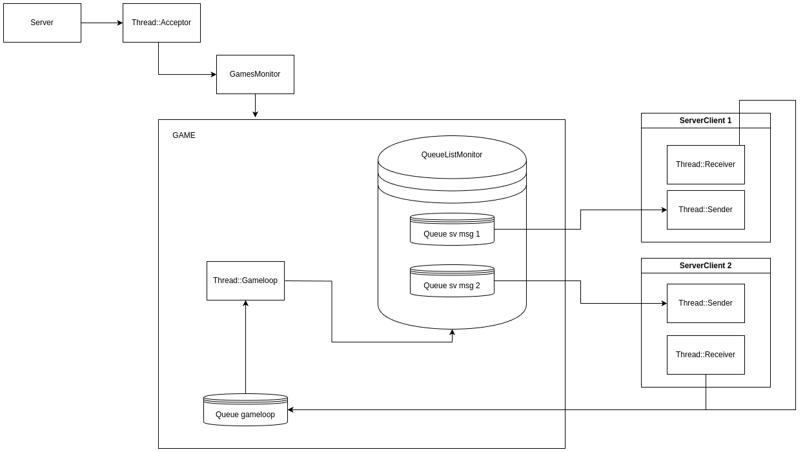
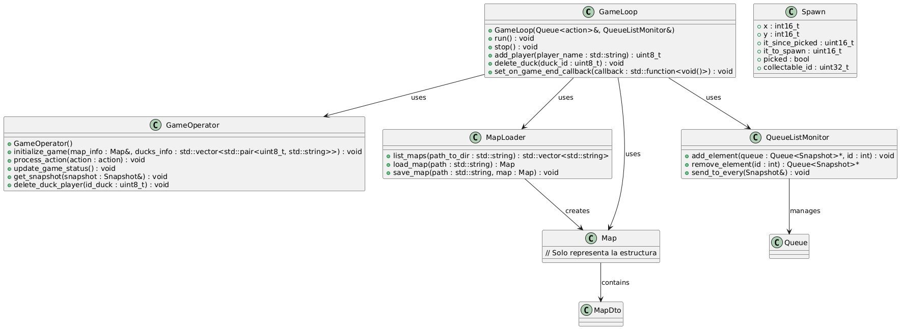
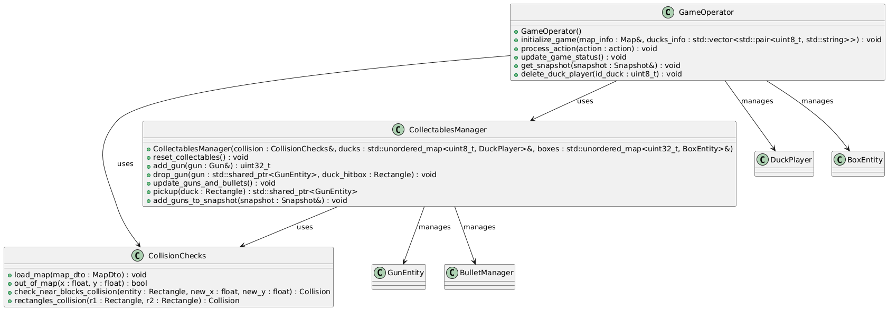
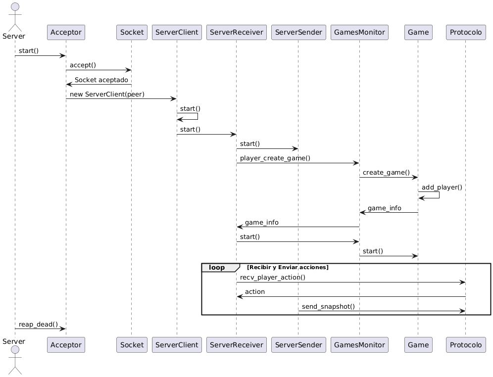
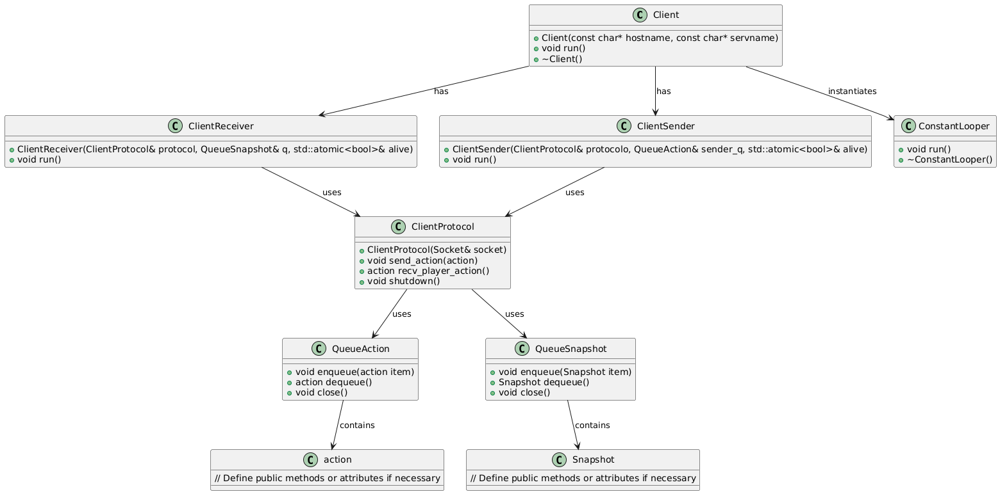
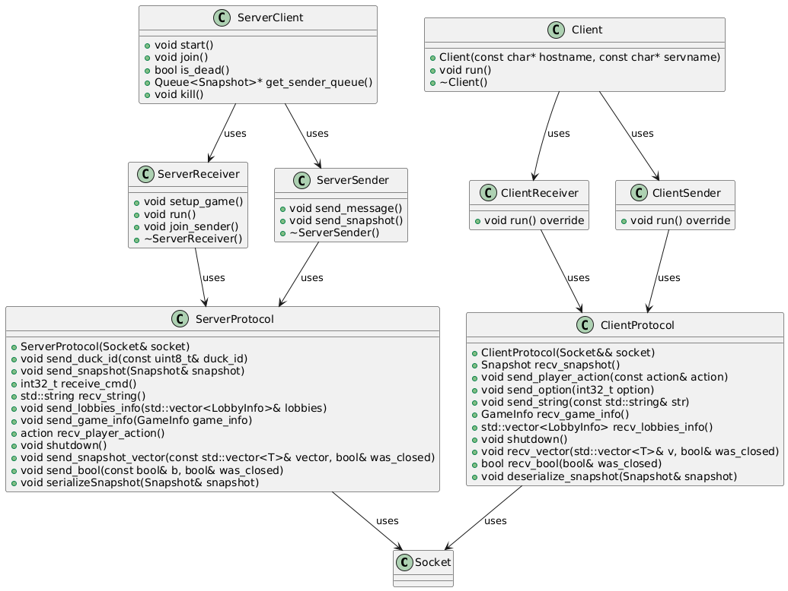

# Documentación técnica

---
Explicacion general de la arquitectura del proyecto, como se manejan las partidas, la comunicación entre cliente y servidor.

## Arquitectura de Server

---

### Estructura para manejar partidas
Para manejar múltiples partidas se utiliza el objeto `GamesMonitor`.
La clase `Game` contiene toda la información de la partida, como los IDs de jugadores, el mapa, y lo necesario para realizar la comuncacion con los ServerClient.

### Estructura Game Loop
Game Loop es el encargado de leer las acciones de los jugadores, las procesa y envía al Game Operator lo que se recibió, luego se obtiene las actualizaciones del estado del juego (snapshots) y se envían a las queues de los jugadores

### Estructura de GameOperator
Game Operator se encarga de la lógica del juego. Maneja la inicialización de los elementos del mapa, control de colisiones, administración de collectables y el estado de cada entidad. 

### Secuencia de inicio de una partida
Se muestra la secuencia de inicio de una partida, donde se crea una nueva partida, se inicializan los elementos del game, se envía la informacion del juego a los jugadores y se inicia el game loop.

## Arquitectura de Cliente

---

### Estructura de cliente
Se muestra la estructura de cliente, donde se maneja la comunicación con el servidor y la interfaz gráfica.
El constant looper se encarga de procesar las acciones del jugador y de recibir los snapshots del estado del juego para mostrarlo por pantalla.

## Comunicación

---

### Comunicación Server - Cliente
Se muestra la comunicación entre el servidor y el cliente, donde el cliente envía las acciones al servidor y el servidor envía los snapshots del estado del juego al cliente.
Toda la comunicacion se realiza mediante socket previamente serializada/deserializada por el protocolo.

