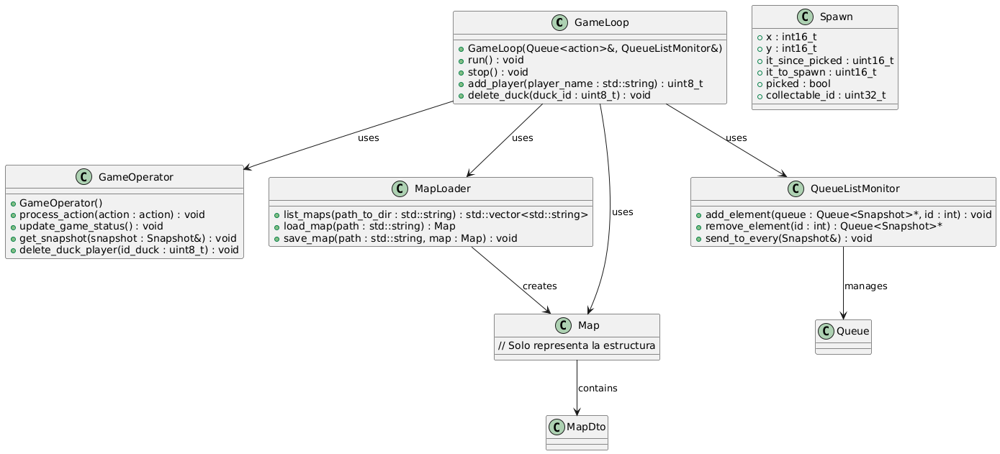
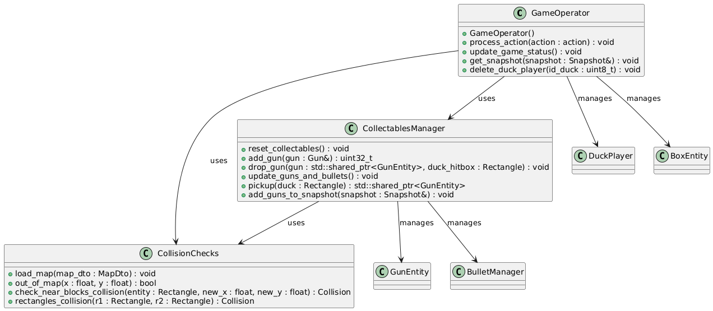
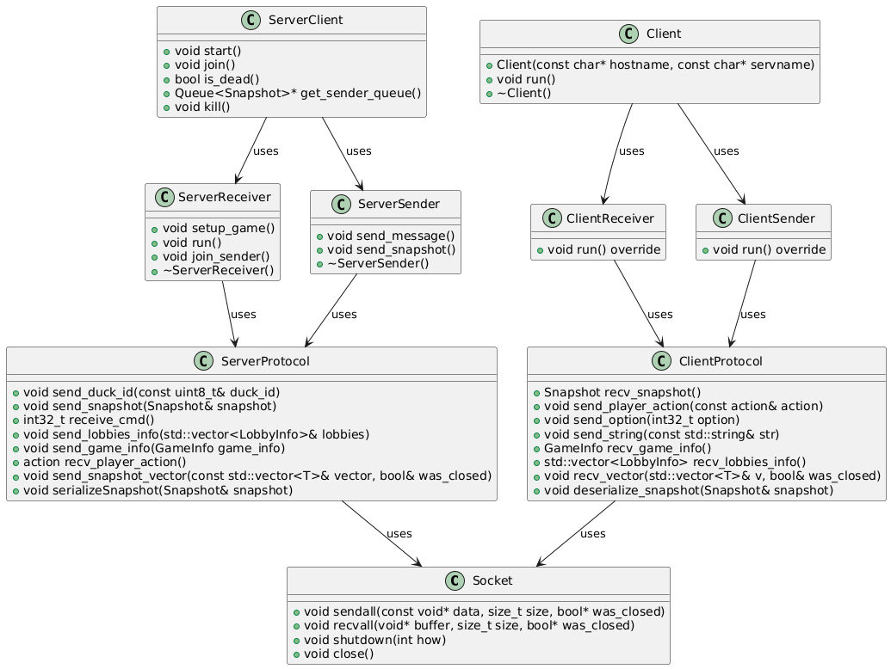

# Documentación técnica

---
Explicacion general de la arquitectura del proyecto, como se manejan las partidas, la comunicación entre cliente y servidor.

## Arquitectura de Server

---

### Estructura para manejar partidas
El server lanza un hilo aceptador encargado de aceptar clientes y crear dos hilos de comunicación por cada cliente (Receiver y Sender).

Para manejar múltiples partidas se utiliza el objeto `GamesMonitor` que tiene una referencia a cada partida en curso.
La clase `Game` contiene toda la información de la partida, como los IDs de jugadores, el mapa, y lo necesario para realizar la comuncacion con los ServerClient.

### Estructura Game Loop
Game Loop es el encargado de leer las acciones de los jugadores, las procesa y envía al Game Operator lo que se recibió, luego se obtiene las actualizaciones del estado del juego (snapshots) y se envían a las queues de los jugadores

### Estructura de GameOperator
Game Operator se encarga de la lógica del juego. Maneja la inicialización de los elementos del mapa, control de colisiones, administración de collectables y el estado de cada entidad. 

### Secuencia de inicio de una partida
Se muestra la secuencia de inicio de una partida, donde se crea una nueva partida, se inicializan los elementos del game, se envía la informacion del juego a los jugadores y se inicia el game loop.

## Arquitectura de Cliente

---

### Estructura de cliente
La estructura del cliente se divide en dos partes, el constant looper y el cliente.
El constant looper se encarga de procesar las acciones del jugador y de recibir los snapshots del estado del juego para mostrarlo por pantalla.
El cliente cuanta con una arquitectura basada en hilos, se tiene in hilo receiver y otro sender que se encargan de la comunicacion, hasta que el cliente o el server se cierre.

### Secuencia de accion hacia servidor
Caso de uso de la secuencia de acción hacia el servidor, donde el cliente envía una acción al servidor.

## Comunicación

---

### Comunicación Server - Cliente
Se muestra la comunicación entre el servidor y el cliente, donde el cliente envía las acciones al servidor y el servidor envía los snapshots del estado del juego al cliente.
Toda la comunicacion se realiza mediante socket previamente serializada/deserializada por el protocolo.

## Tipos de mensajes | Protocolo

---

### Protocolo del servidor

#### Envio de Snapshots
El servidor envía información sobre el estado del juego en formato Snapshot. Esto incluye listas de jugadores, armas, balas, cajas y mapas. Cada tipo de dato es serializado.
- Método: send_snapshot(Snapshot& snapshot)
- Datos enviados:

  - `round_finished` (bool): Indica si la ronda ha terminado.
  - `show_stats` (bool): Indica si se deben mostrar estadísticas.
  - `game_finished` (bool): Indica si el juego ha finalizado.
  - Listas serializadas:
    - `ducks` (posición y estado actual de cada duck)
    - `guns` (armas en el mapa)
    - `bullets` (balas activas)
    - `boxes` (cajas disponibles)
    - `maps` (información del mapa)
- Serialización: Cada atributo dentro de los objetos en las listas es serializado utilizando funciones como `htons` y `htonl`.

#### Otros Métodos del Servidor
- Enviar Información de Lobbies: `send_lobbies_info(std::vector<LobbyInfo>& lobbies)`
- Enviar Información del Juego: `send_game_info(GameInfo game_info)`
- Enviar Opciones del jugador: `send_option(int32_t option)`
- Terminar Comunicación: `shutdown()`

---

### Protocolo del cliente

#### Recepción de Snapshots
Los datos recibidos se deserializan utilizando las funciones `ntohs` y `ntohl`.
- Método: `recv_snapshot()`

#### Envío de Acciones
El cliente envía las acciones realizadas por el jugador al servidor en estructuras `action`. Estas acciones representan comandos específicos del jugador, como moverse, disparar o interactuar con armaduras/armas.
- Método: `void send_player_action(const action& action);`

- Datos enviados:
  - Estructura `action`, que contiene:
    - `uint8_t duck_id`: Identificador de jugador que ejecuta la acción.
    - `enum Command`: Comando que el jugador desea ejecutar.

#### Otros Métodos del Cliente
- Enviar Opciones: `send_option(int32_t option)`
- Recibir Opciones: `recv_option()`
- Recibir Información de Lobbies: `recv_lobbies_info()`
- Recibir Información del Juego: `recv_game_info()`
- Enviar Cadenas: `send_string(const std::string& str)`
- Terminar Comunicación: `shutdown()`