# Manual de usuario

## Tabla de contenidos

1. [🖧 Servidor](#-servidor)
2. [💻 Clientes](#-clientes)
3. [🦆 Juego](#-juego)
4. [🎮 Mecanicas](#-mecanicas)
5. [🔫 Armas](#-armas)
6. [️️🕹️️ Controles](#️-controles)
7. [🛡️ Cheats](#-cheats)
8. [🗺️ Editor de niveles](#️️️️️️-editor-de-niveles)
9. [🔧 Configuración](#-configuración)

## 🖧 **Servidor**

Antes de poder conectar clientes es necesario iniciar un servidor, para esto, una vez instalado el juego, basta con correr el siguiente comando:
```bash
duck_game_server <puerto>
```

Donde `<puerto>` es el puerto donde estará escuchando el mismo.

## 💻 **Clientes**

Para iniciar un cliente, se ejecuta el siguiente comando:

```bash
duck_game_client
```

### **Conexión al servidor**

- Al iniciar un cliente se muestra una ventana que permite conectarse al servidor. Para ello, es necesario ingresar la dirección IP del mismo (en el caso de ejecutar en red local, se usaría la IP de la computadora donde se está ejecutando el mismo) y el puerto en el que está escuchando.

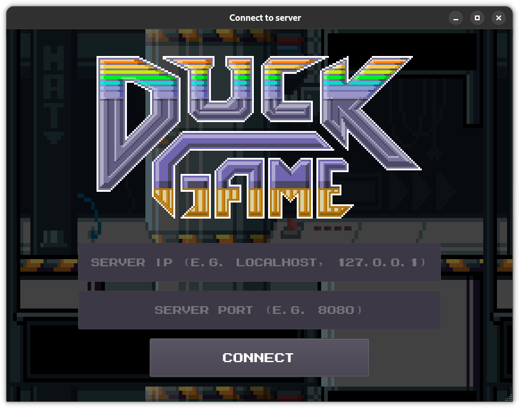

### **Lobby**

- Una vez conectado al servidor, se mostrará un lobby con las opciones para Crear o Unirse a una partida.

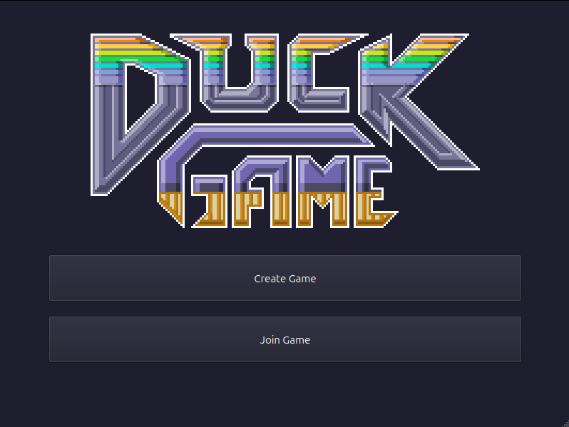

#### **Crear partida:**

- Al seleccionar la opción de *Crear partida* (Create Game), se mostrará un menú para seleccionar la cantidad de jugadores que se conectarán en este cliente gráfico, y la opción para ingresar sus nombres de usuario

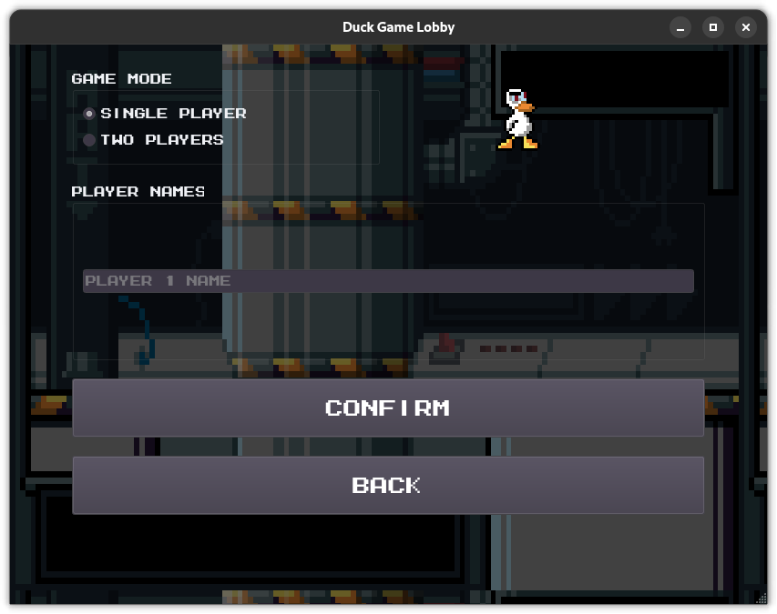

- Una vez ingresados los datos, se mostrará un menú de inicio de partida, donde se esperará a que se unan los jugadores.
 El creador decide cuando iniciar la partida.
- Se puede ver tanto el ID del juego creado, como la cantidad de jugadores conectados actualmente
- Se puede refrescar la cantidad de jugadores conectados con el botón *Refresh*.

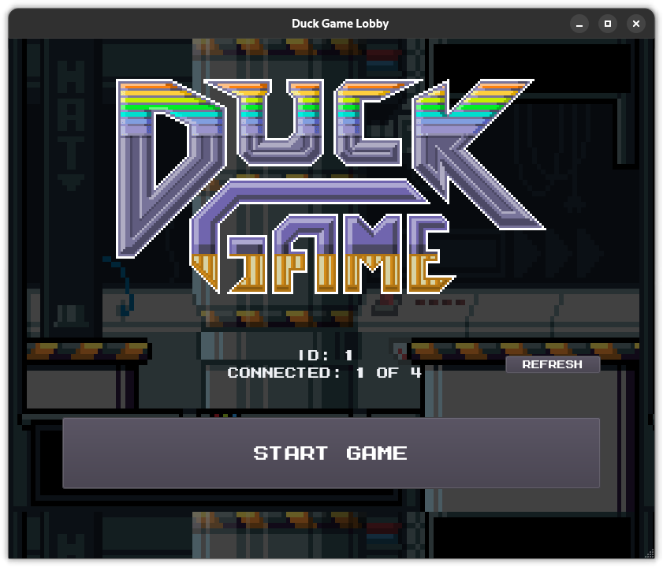

#### **Unirse a partida:**

- Al seleccionar la opción de *Unirse a partida* (Join Game) se listan los juegos disponibles, se puede seleccionar cualquiera de estos y presionar *Join*.
- Se puede refrescar la lista de juegos disponibles con el botón *Refresh*.
- Por cada juego se muestra su ID, la cantidad de jugadores conectados actualmente, y quien es el creador del mismo.

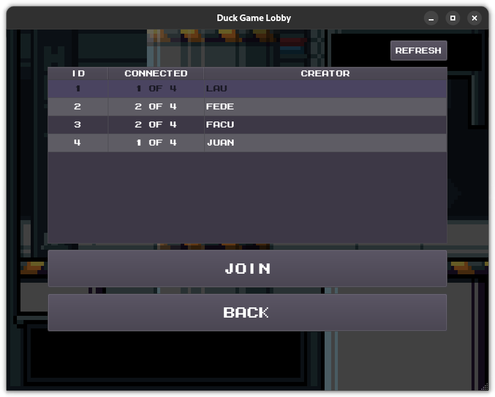

- Una vez elegida la partida, aparecen las mismas opciones que al crear un juego, permitiendo seleccionar la cantidad de jugadores a conectarse en el cliente gráfico y se pide sus nombres.

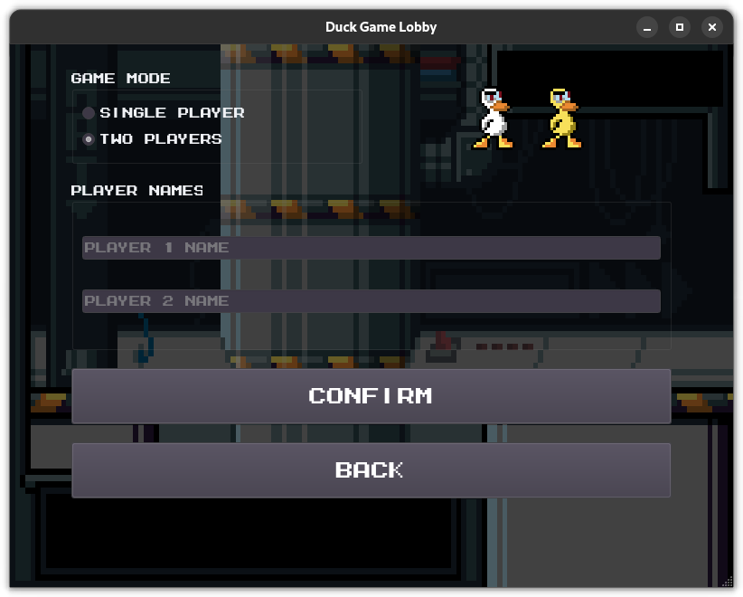

- Una vez ingresados a la partida (luego de presionar *Confirmar* (Confirm), se mostrará una pantalla de espera, donde se esperará a que el creador inicie el juego.
- Se muestra el color y ID del jugador/es

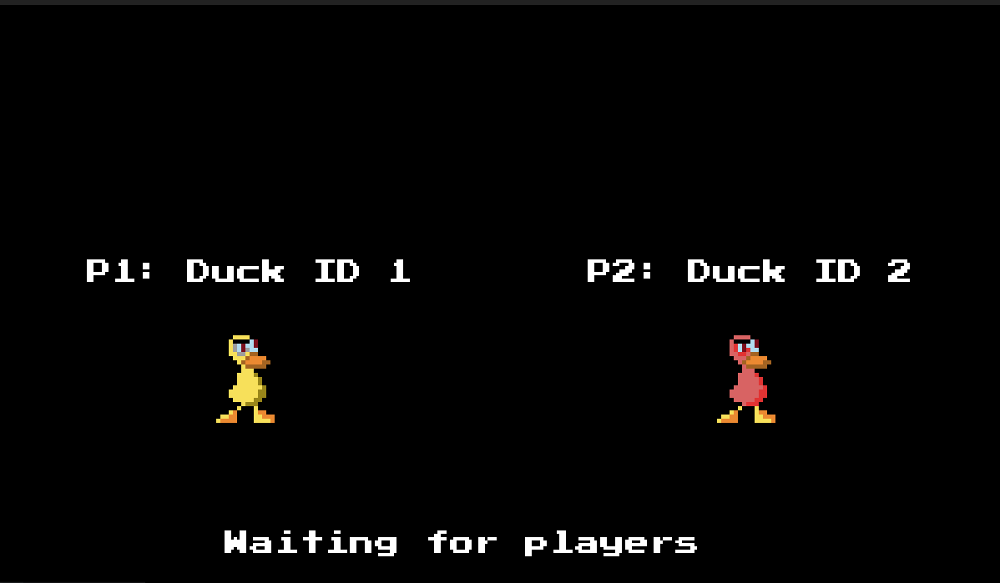

## 🦆 **Juego**

- El objetivo del juego es ser el último jugador en pie.
- Una partida consta de varias rondas
- Cada cinco rondas (configurable, ver sección [configuración](#-configuración)) se mostrará un resumen de las puntuaciones de los jugadores y se verificará si alguno de ellos ganó la partida.
- Si tras 5 rondas nadie ha ganado, se vuelven a jugar otros 5 rondas mas.

#### **Inicio de partida**

- Una vez iniciada la partida, se muestra que pato fue asignado a cada jugador, y empieza la primera ronda.

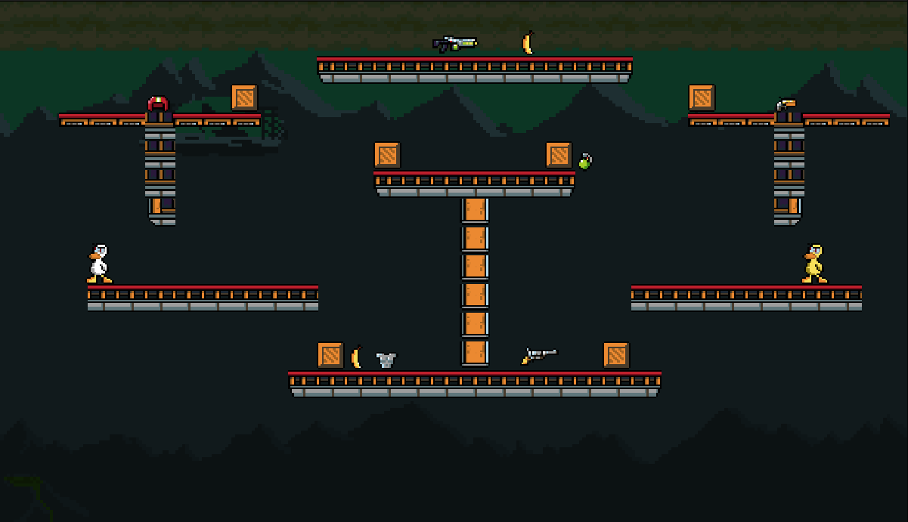


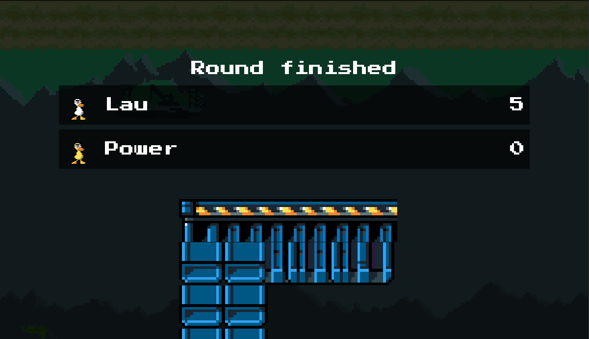

#### **Condición de victoria**

- El jugador que obtenga 10 (nuevamente configurable, ver sección [configuración](#-configuración)) o mas puntos será el ganador. En caso de empate, se vuelven a jugar 5 rondas hasta que pueda declararse un único ganador
- Como la partida se desarrolla en tiradas de 5 rondas, y se busca el ganador unicamente al finalizar estas tiradas, puede pasar que un jugador sea el primero en llegar a 10 rondas y otro jugador termine siendo el ganador

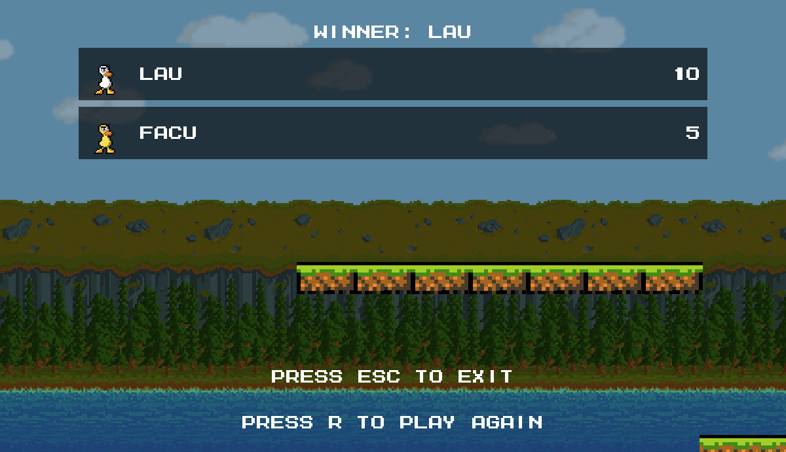

- Una vez terminado el juego, con `ESC` puede cerrase el cliente, o puede decidirse volver a jugar presionando la tecla `r`, lo que lleva de nuevo al [lobby](#1-lobby-inicial)

## 🎮 **Mecanicas**
- Estando en el aire y presionando repetidamente la tecla de salto ( `w` o `↑` según el jugador ), se puede aletear y caer mas despacio.

<p align="center">
  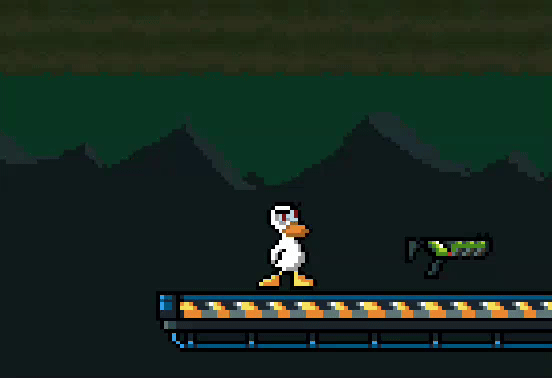
</p>

- **Cajas:** Al disparar a una caja, esta se rompe, puede contener equipamiento (armas y armaduras), **explotar** o estar vacía.

<p align="center">
  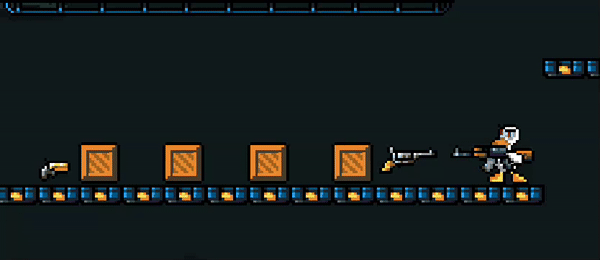
</p>

## 🔫 **Armas**

Las armas pueden aparecer en spawn points, o dentro de cajas. Se encuentran inicialmente cargadas, al quedarse sin municiones, desaparecen automáticamente.
Todas las armas pueden tomarse y soltarse con la tecla `c` (jugador 1) o `k` (jugador 2), y dispararse con la tecla `v` (jugador 1) o `l` (jugador 2). 

El efecto que resulta de disparar depende del arma equipada, generalmente se dispara una o varias balas que puede dañar a los otros jugadores (o a uno mismo).

Las excepciones a esto son:

- **Casco**: Al presionar la tecla de disparo con el casco en la mano, el mismo es equipado por el jugador.
- **Armadura**: Similar al casco, se presiona la tecla de disparo para equiparla.

<p align="center">
  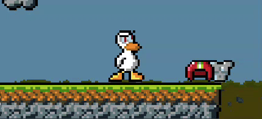
</p>

> ℹ️ Tanto el casco como la armadura protegen al jugador de un disparo, pero se rompen al recibir un impacto.
> Cada jugador puede tener equipado unicamente un casco y una armadura a la vez. Tratar de equipar un casco o armadura cuando ya se tiene uno equipado no tendrá efecto.

- **Escopeta**: Al disparar la misma se descarga, si aun cuenta con munición, será necesario presionar la tecla de disparo nuevamente para recargarla.

- **Granada**: Al disparar con la granada equipada, la misma se activa, y explotará al cabo de unos segundos. La misma puede ser lanzada al igual que cualquier otro arma.

<p align="center">
  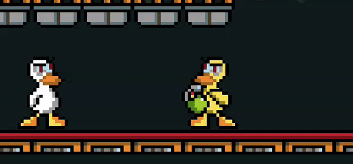
</p>

> ⚠️ **Cuidado**: si la granada no se lanza termina explotando en la mano del jugador que la activó.


- **Banana**: Al disparar con la banana equipada, la misma se activa, para soltarla, al igual que la granada, se presiona la misma tecla para tomar o soltar un arma, esto hará que la banana caiga y permanezca en el suelo, haciendo que cualquier jugador que pase sobre ella se deslice y pierda el control de su pato por un momento.

> **Tip**: Una buena estrategia es lanzar la banana cerca de un borde, para que los jugadores que se resbalen mueran por ir fuera del mapa

## 🕹️ **Controles**

- `1` Toggle mute
- `2` Toggle fullscreen

### Jugador 1:
- `w` `a` `s` `d` para moverse.
- `c` para recoger/soltar equipamientos (armas y armaduras).
- `v` para disparar (caso arma), para equipar (caso armadura).
- `e` para mirar arriba.

### Jugador 2:
- `↑` `↓` `←` `→` para moverse.
- `k` para recoger/soltar equipamientos (armas y armaduras).
- `l` para disparar (caso arma), para equipar (caso armadura).
- `shift derecho` para mirar arriba.

## 🛡️ **Cheats**

Los cheats permiten activar ciertas ventajas en el juego, estos pueden ser activados por los jugadores en cualquier momento siempre y cuando se encuentren activos en la configuración del servidor (ver [configuración](#-configuración)).

### Jugador 1
- `F1` Modo vuelo
- `F2` Munición infinita
- `F3` Matar a todos los otros jugadores
- `F4` Vida infinita
- `F5` Obtener Death Laser

### Jugador 2
- `F8` Modo vuelo
- `F9` Munición infinita
- `F10` Matar a todos los otros jugadores
- `F11` Vida infinita
- `F12` Obtener Death Laser

## 🗺️️️️️️ **Editor de niveles**

Para inciar el editor de niveles:

```bash
duck_game_editor
```

- Una vez iniciado el editor de niveles, se mostrará este pantalla inicial
- Se pueden utilizar las opciones para `Guardar`, `Cargar` o `Borrar` el mapa.


- Una vez seleccionado el tipo de bloque, con `Click Izquierdo` se puede colocar y con `Click Derecho` se puede eliminar.
- Si se desea hacer que el bloque sea traspasable, se puede hacer con `Click Izquierdo` sobre el bloque (teniendo seleccionado el mismo tipo de bloque colocado actualmente).
- También es necesario seleccionar los 4 spawns para los patos, spawns para armas, y ubicaciones de cajas
- Para aumentar el zoom de la grilla hacer `Ctrl + wheel` (ctrl + "ruedita") sobre la misma.

## 🔧 **Configuración**

Gran parte de la configuración del juego puede modificarse a traes del archivo `config.yaml`, al instalarse el juego, el mismo se ubica en `/etc/duck_game/config.yaml`.
Algunos de los aspectos que pueden modificarse son:
- Vida inicial y velocidad del pato
- Rondas necesarias para ganar el juego
- Cantidad de rondas entre que se muestran las estadísticas y se busca un ganador
- Daño, rango, y munición de las armas
- Activar o desactivar cheats

La mayoría de los cambios en la configuración solo tendrán efecto si se realizan en la máquina que actúa como servidor, excepciones sobre esto son los que tienen que ver estrictamente con el cliente, como el tamaño incial de la ventana, o FPS del cliente.