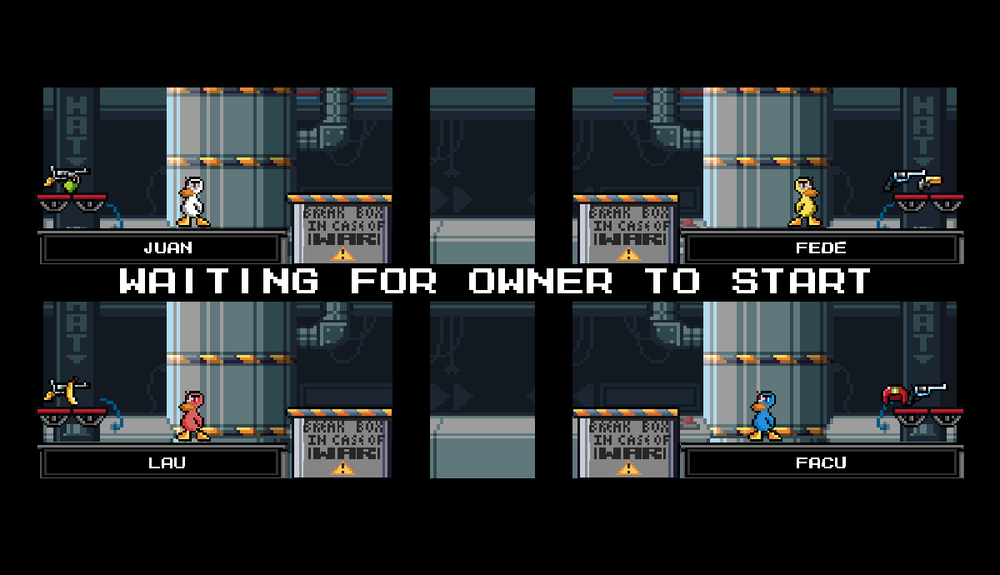
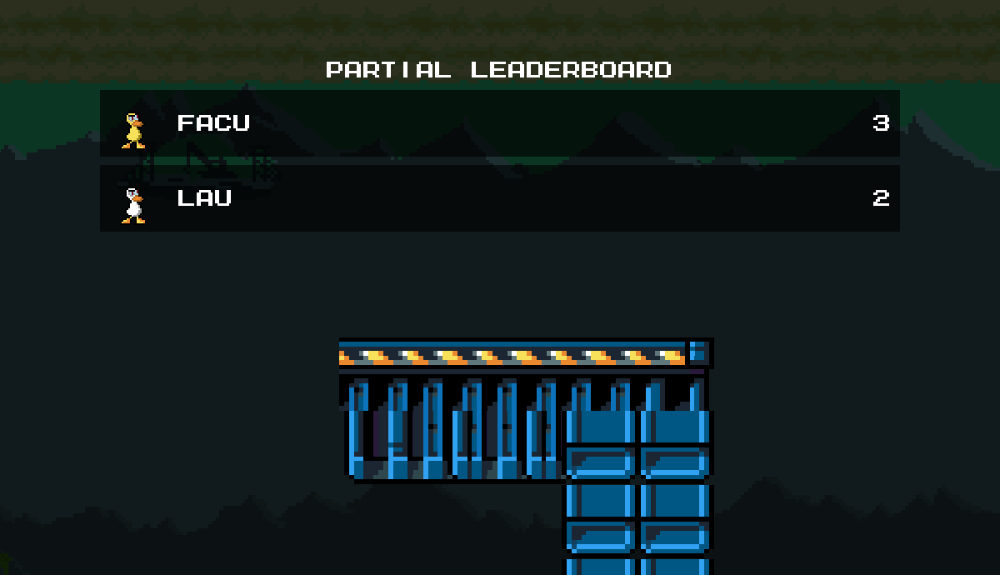
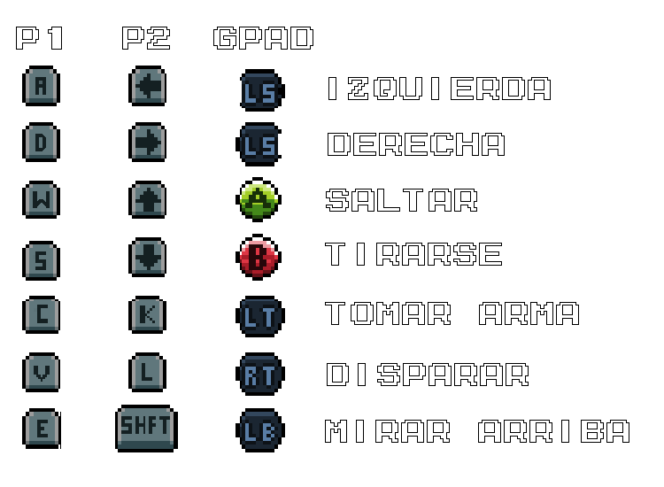
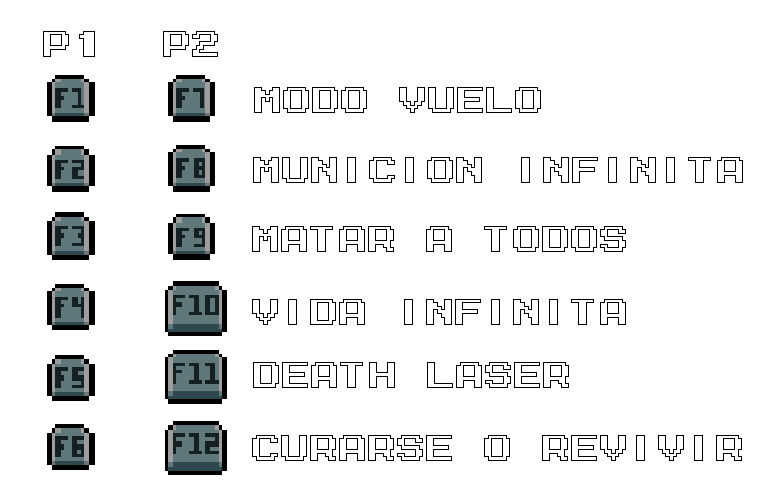

# Manual de usuario

## Tabla de contenidos

1. [🖧 Servidor](#-servidor)
2. [💻 Clientes](#-clientes)
3. [🦆 Juego](#-juego)
4. [🎮 Mecanicas](#-mecanicas)
5. [🔫 Armas](#-armas)
6. [️️🕹️️ Controles](#️-controles)
7. [🛡️ Cheats](#️-cheats)
8. [🗺️ Editor de niveles](#️️️️️️-editor-de-niveles)
9. [🔧 Configuración](#-configuración)

## 🖧 **Servidor**

Antes de poder conectar clientes es necesario iniciar un servidor, para esto, una vez instalado el juego, basta con correr el siguiente comando:
```bash
duck_game_server <puerto>
```

Donde `<puerto>` es el puerto donde estará escuchando el mismo.

## 💻 **Clientes**

Para iniciar un cliente, se ejecuta el siguiente comando:

```bash
duck_game_client
```

### **Conexión al servidor**

- Al iniciar un cliente se muestra una ventana que permite conectarse al servidor. Para ello, es necesario ingresar la dirección IP del mismo (en el caso de ejecutar en red local, se usaría la IP de la computadora donde se está ejecutando el mismo) y el puerto en el que está escuchando.


### **Lobby**

- Una vez conectado al servidor, se mostrará un lobby con las opciones para Crear o Unirse a una partida.


#### **Crear partida:**

- Al seleccionar la opción de *Crear partida* (Create Game), se mostrará un menú para seleccionar la cantidad de jugadores que se conectarán en este cliente gráfico, y la opción para ingresar sus nombres de usuario


- Una vez ingresados los datos, se mostrará un menú de inicio de partida, donde se esperará a que se unan los jugadores.
 El creador decide cuando iniciar la partida.
- Se puede ver tanto el ID del juego creado, como la cantidad de jugadores conectados actualmente
- Se puede refrescar la cantidad de jugadores conectados con el botón *Refresh*.


#### **Unirse a partida:**

- Al seleccionar la opción de *Unirse a partida* (Join Game) se listan los juegos disponibles, se puede seleccionar cualquiera de estos y presionar *Join*.
- Se puede refrescar la lista de juegos disponibles con el botón *Refresh*.
- Por cada juego se muestra su ID, la cantidad de jugadores conectados actualmente, y quien es el creador del mismo.


- Una vez elegida la partida, aparecen las mismas opciones que al crear un juego, permitiendo seleccionar la cantidad de jugadores a conectarse en el cliente gráfico y se pide sus nombres.


- Una vez ingresados a la partida (luego de presionar *Confirmar* (Confirm), se ingresa a la sala de espera, donde se esperará a que el creador inicie el juego.
- Se muestra a cada jugador conectado actualmente en su cuadrante, con su nombre de usuario abajo, pueden moverse por la sala, disparar, etc.



## 🦆 **Juego**

- El objetivo del juego es ser el último jugador en pie.
- Una partida consta de varias rondas
- Cada cinco rondas (configurable, ver sección [configuración](#-configuración)) se mostrará un resumen de las puntuaciones de los jugadores y se verificará si alguno de ellos ganó la partida.
- Si tras 5 rondas nadie ha ganado, se vuelven a jugar otros 5 rondas mas.

#### **Inicio de partida**

- Una vez que el creador decida iniciar la partida, ya será capaz de controlar a su pato en la sala de espera y aparecerán cajas en los cuadrantes de los jugadores, cuando cada jugador conectado rompa su caja, comenzará el juego


#### **Condición de victoria**

- El jugador que obtenga 10 (nuevamente configurable, ver sección [configuración](#-configuración)) o mas puntos será el ganador. En caso de empate, se vuelven a jugar 5 rondas hasta que pueda declararse un único ganador
- Como la partida se desarrolla en tiradas de 5 rondas, y se busca el ganador unicamente al finalizar estas tiradas, puede pasar que un jugador sea el primero en llegar a 10 rondas y otro jugador termine siendo el ganador




- Una vez terminado el juego, con `ESC` puede cerrase el cliente, o puede decidirse volver a jugar presionando la tecla `r`, lo que lleva de nuevo al [lobby](#1-lobby-inicial)

## 🎮 **Mecanicas**
- Estando en el aire y presionando repetidamente la tecla de salto ( `w` o `↑` según el jugador ), se puede aletear y caer mas despacio.

<p align="center">
  
</p>

- **Cajas:** Al disparar a una caja, esta se rompe, puede contener equipamiento (armas y armaduras), **explotar** o estar vacía.

<p align="center">
  
</p>

- **Bloques traspasables:** Los bloques traspasables se marcan en el mapa con un nivel de transparencia que permite reconocerlos.
 Al presionar la tecla de tirarse al suelo (`s` o `↓`) mientras se está sobre un bloque traspasable, se cae a través del mismo. 
 Si se tiene encima un bloque traspasable, se puede saltar a traves de el.

<p align="center">
  
</p>

## 🔫 **Armas**

Las armas pueden aparecer en spawn points, o dentro de cajas. Se encuentran inicialmente cargadas, al quedarse sin municiones, desaparecen automáticamente.
Todas las armas pueden tomarse y soltarse con la tecla `c` (jugador 1) o `k` (jugador 2), y dispararse con la tecla `v` (jugador 1) o `l` (jugador 2).

El efecto que resulta de disparar depende del arma equipada, generalmente se dispara una o varias balas que puede dañar a los otros jugadores (o a uno mismo).

Las excepciones a esto son:

- **Casco**: Al presionar la tecla de disparo con el casco en la mano, el mismo es equipado por el jugador.
- **Armadura**: Similar al casco, se presiona la tecla de disparo para equiparla.

<p align="center">
  
</p>

> ℹ️ Tanto el casco como la armadura protegen al jugador de un disparo, pero se rompen al recibir un impacto.
> Cada jugador puede tener equipado unicamente un casco y una armadura a la vez. Tratar de equipar un casco o armadura cuando ya se tiene uno equipado no tendrá efecto.

- **Escopeta**: Al disparar la misma se descarga, si aun cuenta con munición, será necesario presionar la tecla de disparo nuevamente para recargarla.

- **Granada**: Al disparar con la granada equipada, la misma se activa, y explotará al cabo de unos segundos. La misma puede ser lanzada al igual que cualquier otro arma.

<p align="center">
  
</p>

> ⚠️ **Cuidado**: si la granada no se lanza termina explotando en la mano del jugador que la activó.


- **Banana**: Al disparar con la banana equipada, la misma se activa, para soltarla, al igual que la granada, se presiona la misma tecla para tomar o soltar un arma, esto hará que la banana caiga y permanezca en el suelo, haciendo que cualquier jugador que pase sobre ella se deslice y pierda el control de su pato por un momento.

> **Tip**: Una buena estrategia es lanzar la banana cerca de un borde, para que los jugadores que se resbalen mueran por ir fuera del mapa

<p align="center">
  
</p>

## 🕹️ **Controles**

- `1` Toggle mute
- `2` Toggle fullscreen

Se muestran, en orden, los controles para el jugador 1 y el jugador 2 por teclado, y los controles para joystick (iguales para ambos).

Si se conecta un solo joystick y en el cliente hay 2 jugadores, este se asigna por defecto al jugador 2 (configurable, ver sección [configuración](#-configuración)). En caso de haber un solo jugador, el joystick se asigna a este. Si se conectan 2 joysticks, se asignan uno a cada jugador.

<p align="center">
  
</p>

## 🛡️ **Cheats**

Los cheats permiten activar ciertas ventajas en el juego, estos pueden ser activados por los jugadores en cualquier momento siempre y cuando se encuentren activos en la configuración del servidor (ver [configuración](#-configuración)).

Se pueden activar los cheats con las siguientes teclas:

<p align="center">
  
</p>

## 🗺️️️️️️ **Editor de niveles**

Para inciar el editor de niveles:

```bash
duck_game_editor
```

- Una vez iniciado el editor de niveles, se mostrará este pantalla inicial
- Se pueden utilizar las opciones para `Guardar`, `Cargar` o `Borrar` el mapa.


- Una vez seleccionado el tipo de bloque, con `Click Izquierdo` se puede colocar y con `Click Derecho` se puede eliminar.
- Si se desea hacer que el bloque sea traspasable, se puede hacer con `Click Izquierdo` sobre el bloque (teniendo seleccionado el mismo tipo de bloque colocado actualmente).
- También es necesario seleccionar los 4 spawns para los patos, spawns para armas, y ubicaciones de cajas
- Para aumentar el zoom de la grilla hacer `Ctrl + wheel` (ctrl + "ruedita") sobre la misma.

Una vez terminado el mapa, se puede guardar con el botón `Save map` (guardar mapa), en ese momento se pedirá un nombre para el mapa, y al confirmar se mostrará un mensaje indicando si el mapa se guardó correctamente o no.
En caso de estar editando un mapa existente, si al guardarlo se elige el mismo nombre, se sobreescribirá el mapa existente, en caso contrario se creará un nuevo mapa con el nombre ingresado y el original no se verá afectado.

Si el juego está instalado, los mapas se guardan en `XDG_DATA_HOME/duck_game/maps` (por defecto `~/.local/share/duck_game/maps`), y es donde el servidor buscará los mapas para las partidas.
Si se quiere compartir un mapa, se puede copiar el archivo cuyo nombre es el que se eligió al guardarlo, y con ubicarlo en la misma carpeta en otra computadora, el mismo estará disponible para ser jugado por el usuario.

Durante una partida, los mapas se iran eligiendo de forma aleatoria en cada ronda.

## 🔧 **Configuración**

Gran parte de la configuración del juego puede modificarse a traes del archivo `config.yaml`, al instalarse el juego, el mismo se ubica en `/etc/duck_game/config.yaml`.
Algunos de los aspectos que pueden modificarse son:
- Vida inicial y velocidad del pato
- Rondas necesarias para ganar el juego
- Cantidad de rondas entre que se muestran las estadísticas y se busca un ganador
- Daño, rango, y munición de las armas
- Activar o desactivar cheats
- A que jugador se asigna el joystick en caso de haber solo uno conectado (ver first_gamepad_player)

La mayoría de los cambios en la configuración solo tendrán efecto si se realizan en la máquina que actúa como servidor, excepciones sobre esto son los que tienen que ver estrictamente con el cliente, como el tamaño incial de la ventana, o a quien se asigna el primer joystick.
