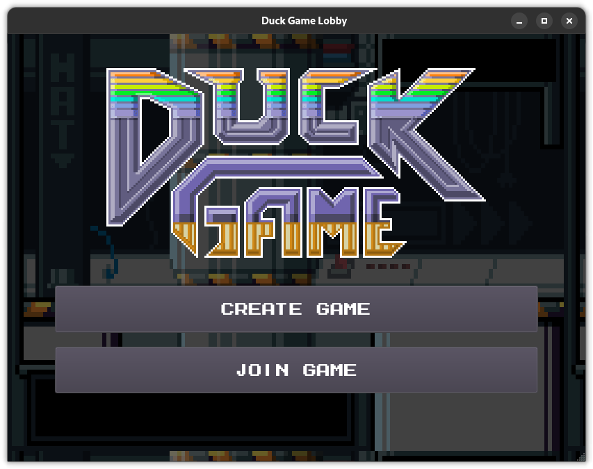
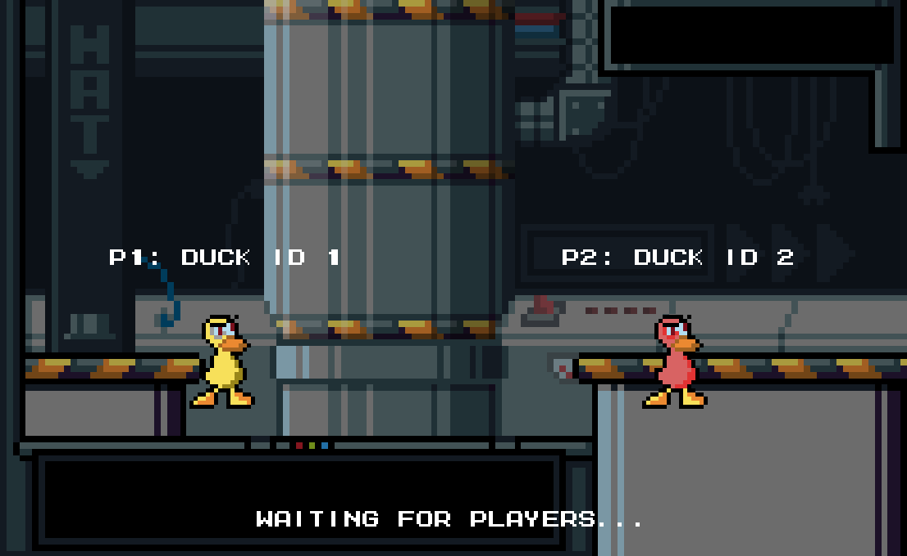

# Manual de usuario

## Cómo jugar

## 1. **Lobby inicial:**
     
- Al iniciar el juego, se mostrará un lobby con las opciones para Crear o Unirse a una partida.

### 1.1. **Crear partida:**

- Al seleccionar la opción de Crear partida, se mostrará un menú para ingresar el nombre de jugadores y la cantidad.

### 1.1.1. **Menu de inicio de Partida:**
 
- Una vez ingresados los datos, se mostrará un menú de inicio de partida, donde se esperará a que se unan los jugadores.
 El creador decide cuando iniciar la partida.
- Se puede refrescar la lista de jugadores conectados con el botón `Refresh`.

### 1.2. **Unirse a partida:**

- Al seleccionar la opción de Unirse a partida se listan los juegos disponibles, se selecciona uno y se ingresa el nombre del jugador.
- Se puede refrescar la lista de lobbys disponibles con el botón `Refresh`.

### 1.2.1. **Ingreso a partida:**

- Una vez elegida la partida deseada se mostrará el menú para ingresar el nombre de jugadores y la cantidad.

### 1.2.2. **Menu de inicio de Partida:**

- Una vez ingresados a la partida, se mostrará un menú de inicio de partida, donde se esperará a que se unan los jugadores.
    Se muestra el color y ID del jugador.

## 2. **Juego:**

- El objetivo del juego es ser el último jugador en pie.
- Una partida consta de 5 rounds, al final de los cuales se mostrará un resumen de las puntuaciones de los jugadores.
- Si tras 5 rounds nadie ha ganado, se vuelven a jugar otros 5 rounds mas.

### 2.1 **Inicio de partida:**

- Una vez iniciada la partida, se mostrará el juego.

- Cada cinco rounds se mostrará un resumen de las puntuaciones de los jugadores.

2.2 **Condición de victoria:**

- El jugador que obtenga 10 o mas puntos será el ganador.

## 3. **Mecanicas:**
- Estando en el aire y presionando repetidamente la tecla de salto ( `w` o `↑` ), se puede aletear y caér mas despacio. 
- **CAJAS:** Al disparar una caja, esta se rompe y puede contener equipamiento (armas y armaduras).

## 4. **Controles:**

- `1` Toggle mute
- `2` Toggle fullscreen

#### Jugador 1:
- `w` `a` `s` `d` para moverse.
- `c` para recoger/soltar equipamientos (armas y armaduras).
- `v` para disparar (caso arma), para equipar (caso armadura).
- `e` para mirar arriba.

#### Jugador 2:
- `↑` `↓` `←` `→` para moverse.
- `i` para recoger/soltar equipamientos (armas y armaduras).
- `o` para disparar (caso arma), para equipar (caso armadura).
- `p` para mirar arriba.

### Cheats
#### Jugador 1
- `F1` FlyMode
- `F2` InfiniteAmmo
- `F3` KillEveryone
- `F4` InfiniteHP
- `F5` GetDeathLaser

#### Jugador 2
- `F8` FlyMode
- `F9` InfiniteAmmo
- `F10` KillEveryone
- `F11` InfiniteHP
- `F12` GetDeathLaser

## 5. **Editor de niveles:**

- Una vez iniciado el editor de niveles, se mostrará este pantalla inicial 
- Se pueden utilizar las opciones para `Guardar`, `Cargar` o `Borrar` el mapa.

- Una vez seleccionado el tipo de bloque, con `Click Izquierdo` se puede colocar y con `Click Derecho` se puede eliminar.
- Si se desea hacer que el bloque sea transpasable, se puede hacer con `Click Izquierdo` sobre el bloque.

